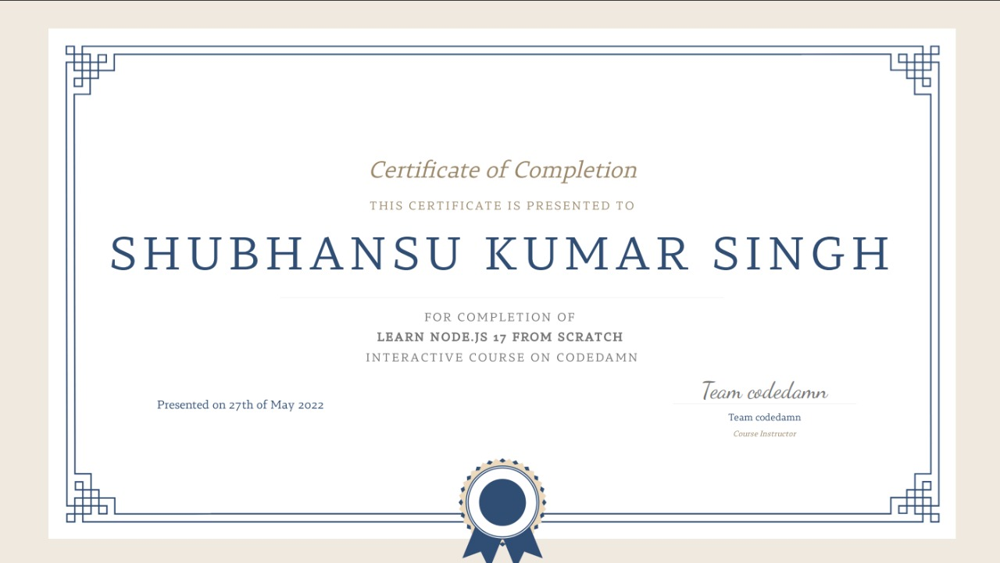

# Node-JS

I took the [Codedamn's](https://codedamn.com/) [Learn Node.js 17 from Scratch](https://codedamn.com/learn/nodejs-fundamentals) and [FreeCodeCampOrg's](https://www.youtube.com/c/Freecodecamp) [Node.js and Express.js - Full Course](https://www.youtube.com/watch?v=Oe421EPjeBE) to learn the basics of NodeJS and Express library.

- CodeDamn's [Learn Node.js 17 from Scratch](https://codedamn.com/learn/nodejs-fundamentals) course covers fundamentals of Node.js as a backend programming language and aims to get you just comfortable enough to start your backend journey without being afraid of working with a real programming language.

- FreeCodeCampOrg's [Node.js and Express.js - Full Course](https://www.youtube.com/watch?v=Oe421EPjeBE) is a 8 hr long free course to cover the theoratical as well as practical applications of NodeJS as a programming language.  

### Documentation

1. All the code files from the FreeCodeCampOrg course is placed in the folder [CodeCamp](./CodeCamp/). The folder is further divided into sub-folders: 
    1. Basic Theoratical concepts and code files are placed in the [00_Basics](./CodeCamp/00_Basics/) folder.
    2. Code files related to Node package manager is placed in [01_NPM](./CodeCamp/01_NPM/) folder.
    3. Practical concepts related to event loops code files are placed in the [02_Event](./CodeCamp/02_Event/) folder.
    4. All the codes related to HTTP request and response and basic server are placed in the [03_Http](./CodeCamp/03_Http/) folder.
    5. All the codes related to the express library are placed in the [04_Express](./CodeCamp/04_Express/) folder.

2. The code files from the CodeDamn's course is spread across multiple folder which includes: 
    1. [CommonModuleSystem](./CommonModuleSystem/): Modules in NodeJS.
    2. [ES6ModuleSystem](./ES6ModuleSystem/): ES6 Syntax.
    3. [Server](./Servers/): Basic servers created using node and express.

3. Project: [Server to manage Book Library](./Project/). Created the project as a part of codeDamn's project challenge. Took assistance from codedamn community.

4. [Public](./Public/) and [DummyProject](./DummyProject/) are the frontend application used for learning purpose in creating server for frontend apps. 

5. Used lodash, express, body-parser and morgan packages as dependencies in the project. Run `npm install` to download these dependencies. [package.json](./package.json) file is uploaded here, while node-modules is ignored by git for proper management.  

6. Dummy.txt and Rummy.txt are the text file created to learn the concepts of file system ('fs') in Node. 

### Learnings 
This course was full of learnings. Really Grateful to [John Smilga](https://github.com/john-smilga) and [MehulMohan](https://www.linkedin.com/in/mehulmpt) for creating such wonderful and educational courses.

Learned a lot about NodeJS as a programming language, theoratical conceps like event loops, ES6 syntax, module system in node etc. What is NPM, how NPM works with git, and maintains the version using package json and package lock json. Most importantly how servers are created using node and how express is used to make middlewares and implement them. 

Some of the Learning highlights are : 
* Path, OS, file & http Module
* Node Package Manager
* EventLoop, Sync vs Async patterns
* Setup Promise, EventEmitter & Streams
* Http Methods - Get, Put, Post, Delete
* Creating servers to respond to HTTP req
* Using Express to create middlewares and use prdefined functions. 
* Interacting with frontend 
* Taking input from frontend and updating the data base.

### Profiles and Certificates: 

Check out my codedamn profile for code certification [@shubhansu](https://codedamn.com/user/shubhansu).   

Course [Certificate](./NodeJs%20-%20Codedamn.pdf) :    

 

Course Duration: 20th April 2022 to 6th June 2022.
> This course took more time than usual due to Sem-II End Term Examination in the month of may from 12th may to 25th may. 
